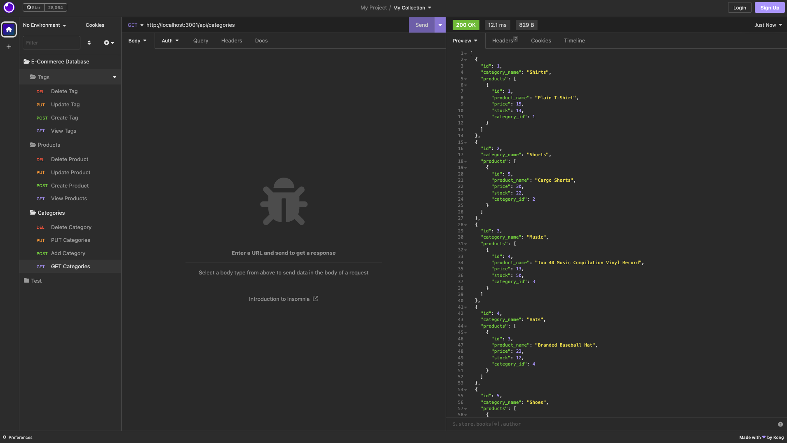
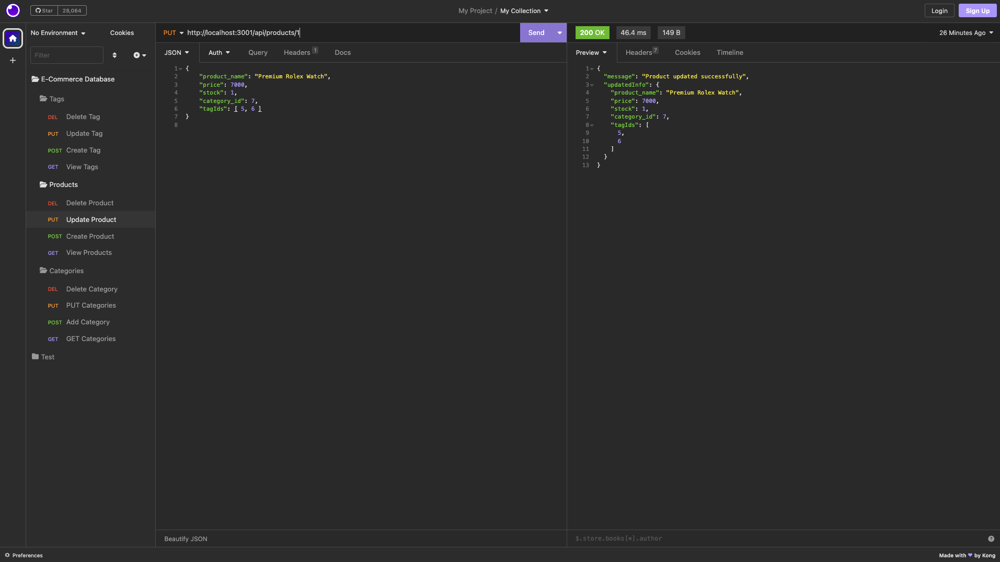
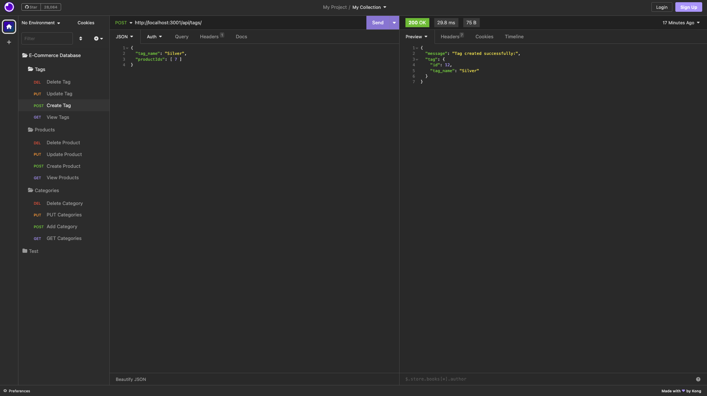

## Ecommerce Database Manager by Elibrer 


*This application can be used to View, Create, Update, and Delete tables from within an ecommerce database - specifically Categories, Tags, and Products*

---

## Languages used
  [](https://www.mysql.com/)

 [](https://www.npmjs.com/package/sequelize)  [](https://expressjs.com/)

---

## Links
> - [GitHub Repository](https://github.com/elibrer/ecommerce-backend)
> 
> - [Video Walkthrough](https://drive.google.com/file/d/1SEDynx8LiDZoI35kFftsVPfwZz8IeuTj/view?usp=share_link)

---

## Contributors
> Elijah Brereton @[GitHub](https://github.com/elibrer)

---

## Table of Contents
- [Description](#description)
- [Installation](#installation)
- [Features](#features)
- [Documentation](#documentation)
- [Application Preview](#full-preview)
- [License](#license)
- [Tests](#tests)
- [Questions](#questions)

---

## Description
If you run a business or work in a job where inventory tracking is necessary, then this application is for you. With this ecommerce database manager the user is able to keep track of everything they have within their store. The application can be changed to fit any need, although it's currently designed for an online store. Being able to view, add, update, or delete categories, products and product tags, the user can have peace of mind knowing that all of their stock is accounted for. Full control over the system gives the user the freedom to organise their data however they please.  

---

## Installation
Ensure `insomnia` has been installed on your system. For instructions on how to do this please visit [insomnia.rest](https://insomnia.rest/)

Ensure `mysql` has been installed on your system. For instructions on how to do this please visit: [dev.mysql.com](https://dev.mysql.com/doc/mysql-installation-excerpt/5.7/en/)

Ensure `node.js` has been installed on your system. For instructions on how to do this please visit: [nodejs.org](https://nodejs.org/en). 


Once `node.js` has been installed the user can open the root directory of this application within any console or terminal type program. Check to see if you are in the right location by typing and entering:
```
ls
```
If the root directory is named `ecommerce-backend` and there is an `index.js` file within, the user can then proceed. 

Next, the user may type and enter: 
```
npm install
```
to install all required packages found within the `package.json` file. This will install `sequelize`, `express.js`, `dotenv`, and `mysql2`. 

Next, the user will need to provide their own `.env` file within the root directory, containing these four parameters. Copy/paste this into the `.env` file and edit the `DB_PASSWORD` parameter to be their own `mysql` password.
```
DB_HOST='localhost'
DB_USER='root'
DB_PASSWORD='UsersMySqlPassword'
DB_NAME='ecommerce_db'
```

If all of the required packages have been successfully installed and the `.env` file is in place, the user may proceed by starting up mysql within their terminal (still set to the root directory) and typing and entering:
```
mysql -u root -p
```
in which the user must provide their `mysql` password. 

The user can then proceed by typing and entering:
```
source ./db/schema.sql
```
to create the `ecommerce_db` database. (WARNING - ensure any previous `ecommerce_db` databases are backed up or renamed, as this will delete all previous entries).

If previous steps have been completed succesfully, the user may start the application by typing and entering:
```
node server.js
```
or
```
npm start
```
into the console. If successful, the termial will display 'Now listening on port: 3001', meaning the local server is up and running.  

---

If there are any issues with running the `npm install` command, please follow these instructions to manually install all packages:

The user will need to ensure the `express.js` package is installed. This can be done by typing and entering:
```
npm i express
```
Next, install the `sequelize` package:
```
npm i sequelize
```
Next, install the `mysql2` package:
```
npm i mysql2
```
Finally install the `dotenv` package:
```
npm i dotenv
```

---

## Features
- When the terminal directory is set to the root directory of the application
- Then the user may begin
- When the user runs the `source ./db/schema.sql` command within mysql in the root directory
- Then an empty database called `ecommerce_db` is created
- When the user creates a .env file with the required data mentioned above
- Then they are able to connect to the `ecommerce_db` database using Sequelize
- When the user enters the seed commands by typing and entering: 
```
node ./seeds/index.js
```
- Then the `ecommerce_db` database is seeded with test data
- When the user enters the command to invoke the application 
```
node server.js
```
or
```
npm start
```
- Then the server is started and the Sequelize models are synced to the MySQL database
- When the user opens API GET routes in Insomnia for categories, products, or tags
- Then the data for each of these routes is displayed in a formatted JSON
- When the user tests the API POST, PUT, and DELETE routes in Insomnia
- Then the user is able to successfully create, update, and delete data in my database

---

## Documentation
No documentation provided.

---

## Application Preview
### `Preview of all categories`

### `Preview of a product being updated`

### `Preview of a tag being created`


---

## License
[Licensed under the MIT license.](https://opensource.org/licenses/MIT)

---

## Tests
To test, create the database using 
```
mysql -u root -p
```
in which the user must provide their `mysql` password, then typing and entering: 
```
source ./db/schema.sql
```
as per usual. Then seed the database with included `./seeds/index.js` file by typing and entering:
```
The user may now test this application using preset data, in which every table is populated. If using insomnia or running any of the terminal commands returns an error then please do not hesistate to contact me at the email address listed below, or by messaging on my GitHub profile.
---

## Questions
For questions and enquiries, please contact me at: 
[eli.brer@gmail.com](eli.brer@gmail.com)